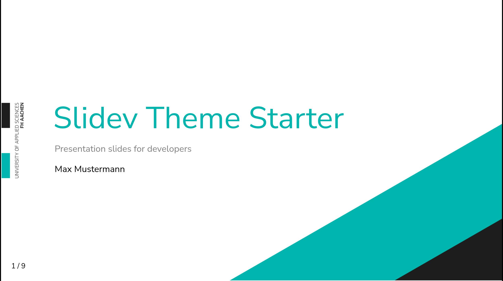
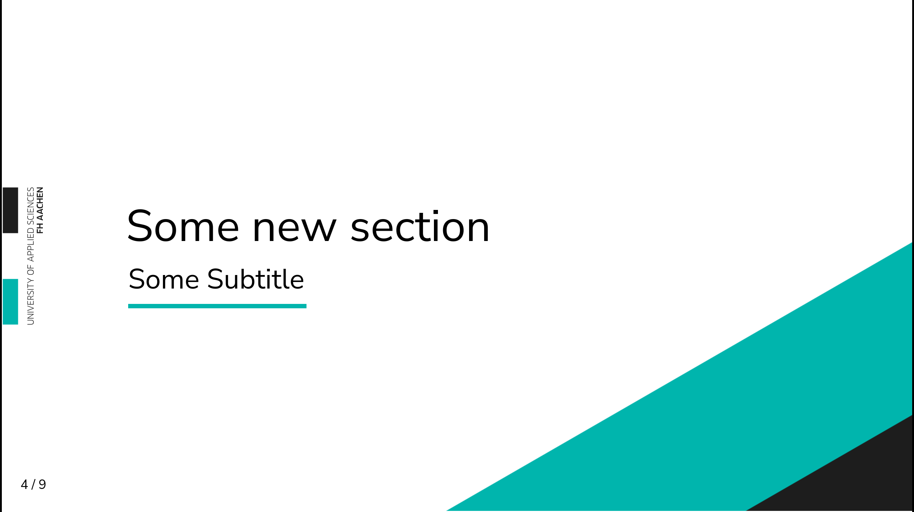
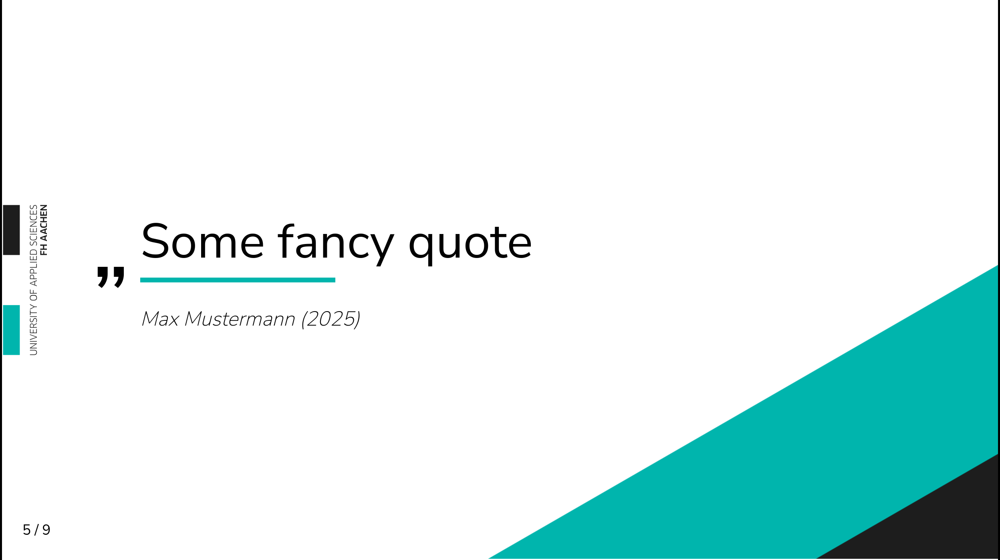
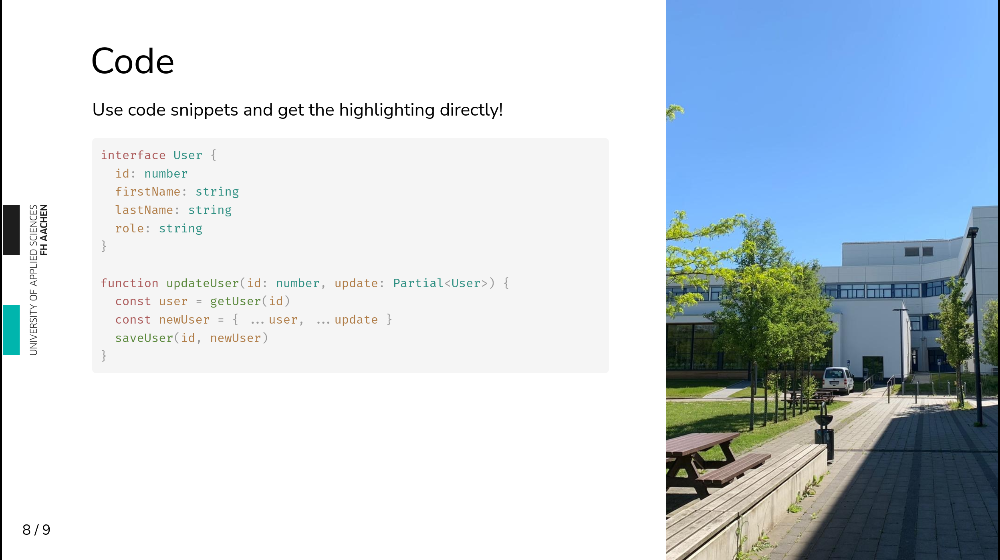
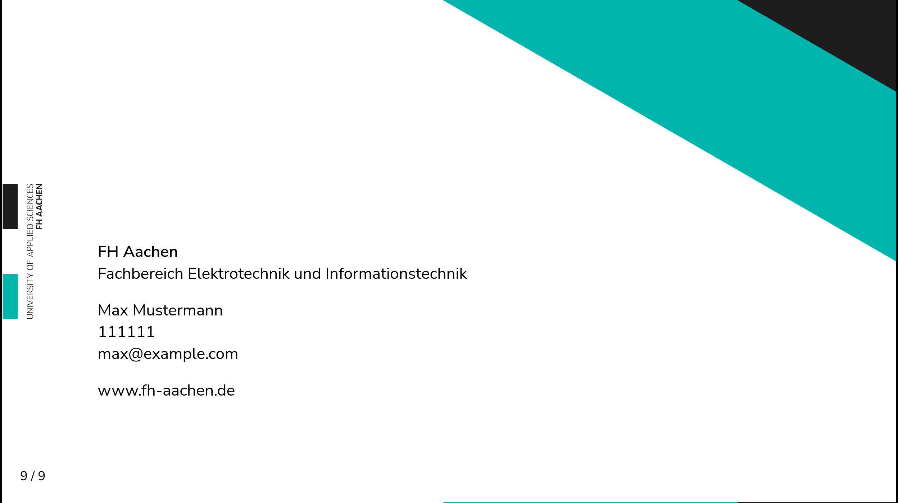
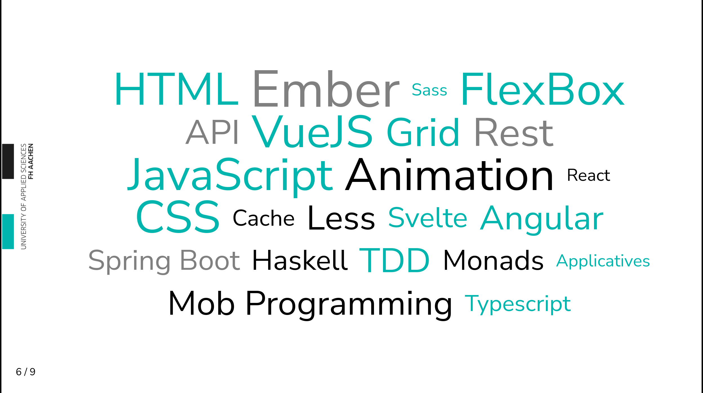

# slidev-theme-fh-aachen

[](https://www.npmjs.com/package/slidev-theme-slidev-fh-aachen)

A FH Aachen theme for [Slidev](https://github.com/slidevjs/slidev).

<!--
  Learn more about how to write a theme:
  https://sli.dev/guide/write-theme.html
--->

<!--
  run `npm run dev` to check out the slides for more details of how to start writing a theme
-->

<!--
  Put some screenshots here to demonstrate your theme

  Live demo: [...]
-->

## Install

Add the following frontmatter to your `slides.md`. Start Slidev then it will prompt you to install the theme automatically.

<pre><code>---
theme: <b>slidev-fh-aachen</b>
---</code></pre>

Learn more about [how to use a theme](https://sli.dev/guide/theme-addon#use-theme).

## Layouts

This theme provides the following layouts:

### Intro

```md
---
layout: intro
---
```



### Section

```md
---
layout: section
---

# Title

## Subtitle
```



### Quote

```md
---
layout: quote
author: Max Mustermann
---

Some Quote
```



### Image Right Half

```md
---
layout: image-right-half
image: ...
---

# Left Body
```



### End

```md
---
layout: end
author: Max Mustermann
email: max@example.com
student: 11111
---
```



## Components

This theme provides the following components:

### Word Cloud

```vue
<word-cloud :list="['HTML', 'CSS', ..., 'Vue']" />
```



## Contributing

- `npm install`
- `npm run dev` to start theme preview of `example.md`
- Edit the `example.md` and style to see the changes
- `npm run export` to generate the preview PDF
- `npm run screenshot` to generate the preview PNG